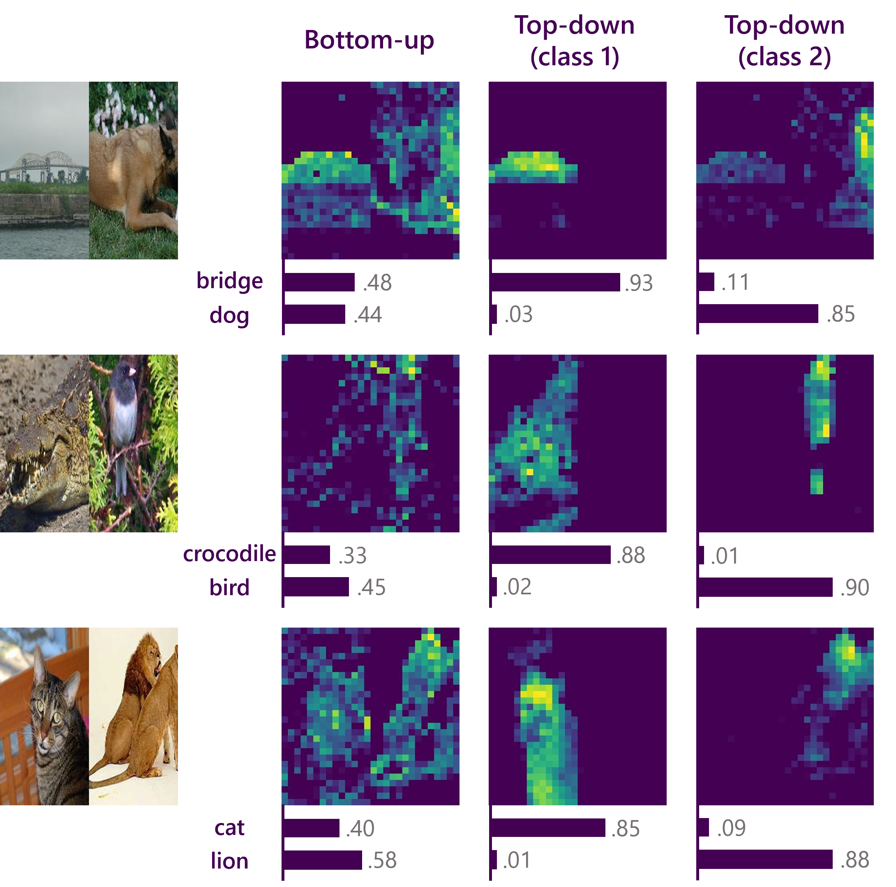

# Top-Down Attention from Analysis by Synthesis

### [Baifeng Shi](https://bfshi.github.io), [Trevor Darrell](https://people.eecs.berkeley.edu/~trevor/), [Xin Wang](https://xinw.ai/)




# Usage

Install PyTorch 1.7.0+ and torchvision 0.8.1+ from the official website.

`requirements.txt` lists all the dependencies:
```
pip install -r requirements.txt
```
In addition, please also install the magickwand library:
```
apt-get install libmagickwand-dev
```

## Demo


## Evaluation

To evaluate AbSViT_small on ImageNet, run

```
python main.py --model absvit_small_patch16_224 --data-path path/to/imagenet --eval --resume path/to/checkpoint
```

To evaluate on robustness benchmarks, please add one of `--inc_path /path/to/imagenet-c`, `--ina_path /path/to/imagenet-a`, `--inr_path /path/to/imagenet-r` or `--insk_path /path/to/imagenet-sketch` to test [ImageNet-C](https://github.com/hendrycks/robustness), [ImageNet-A](https://github.com/hendrycks/natural-adv-examples), [ImageNet-R](https://github.com/hendrycks/imagenet-r) or [ImageNet-Sketch](https://github.com/HaohanWang/ImageNet-Sketch).

If you want to test the accuracy under adversarial attackers, please add `--fgsm_test` or `--pgd_test`.


## Training

Take AbSViT_small for an example. We use single node with 8 gpus for training:

```
python -m torch.distributed.launch --nproc_per_node=8 --master_port 12345  main.py --model absvit_small_patch16_224 --data-path path/to/imagenet  --output_dir output/here  --num_workers 8 --batch-size 128 --warmup-epochs 10
```

To train different model architectures, please change the arguments `--model`. We provide choices of ViT_{tiny, small, base}' and AbSViT_{tiny, small, base}. 


[//]: # (## Links )

[//]: # ()
[//]: # (This codebase is built upon the official code of "[Towards Robust Vision Transformer]&#40;https://github.com/vtddggg/Robust-Vision-Transformer&#41;".)

[//]: # ()
[//]: # (## Citation)

[//]: # (If you found this code helpful, please consider citing our work: )

[//]: # ()
[//]: # (```bibtext)

[//]: # (@article{shi2022visual,)

[//]: # (  title={Visual Attention Emerges from Recurrent Sparse Reconstruction},)

[//]: # (  author={Shi, Baifeng and Song, Yale and Joshi, Neel and Darrell, Trevor and Wang, Xin},)

[//]: # (  journal={arXiv preprint arXiv:2204.10962},)

[//]: # (  year={2022})

[//]: # (})

[//]: # (```)