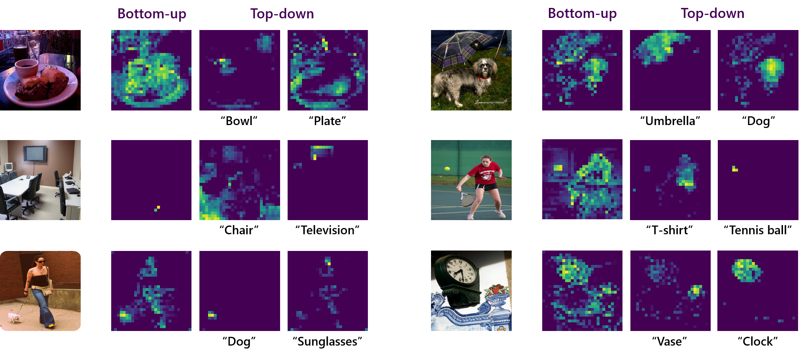

# Top-Down Visual Attention from Analysis by Synthesis


This is the official codebase of AbSViT, from the following paper:

Top-Down Visual Attention from Analysis by Synthesis, CVPR 2023\
[Baifeng Shi](https://bfshi.github.io), [Trevor Darrell](https://people.eecs.berkeley.edu/~trevor/), and [Xin Wang](https://xinw.ai/)\
UC Berkeley, Microsoft Research




## To-Dos

- [ ] Finetuning on Vision-Language datasets


<!-- ✅ ⬜️  -->


## Environment

Install PyTorch 1.7.0+ and torchvision 0.8.1+ from the official website.

`requirements.txt` lists all the dependencies:
```
pip install -r requirements.txt
```
In addition, please also install the magickwand library:
```
apt-get install libmagickwand-dev
```

## Demo

[`demo/demo.ipynb`](demo/demo.ipynb) gives an example of visualizing AbSViT's attention map on single-object and multi-object images.

## Model Zoo

| Name | ImageNet |   ImageNet-C (↓)   | PASCAL VOC | Cityscapes | ADE20K |                                       Weights                                        |
|:---:|:---:|:------------------:|:---:|:---:|:---:|:------------------------------------------------------------------------------------:|
| ViT-Ti | 72.5 |        71.1        | - | - | - | [model](https://berkeley.box.com/shared/static/mw99ywof7ri7kczq79iwjia2att2dpmh.pth) |
| AbSViT-Ti | 74.1 |        66.7        | - | - | - | [model](https://berkeley.box.com/shared/static/0n2tvn9hmx7bwv097nwb60vw1jf4841n.pth) |
| ViT-S | 80.1 |        54.6        | - | - | - | [model](https://berkeley.box.com/shared/static/tftkkov22978lmvgv1g1cxuuk62iacn7.pth) |
| AbSViT-S | 80.7 |        51.6        | - | - | - | [model](https://berkeley.box.com/shared/static/3wpkf5qo31ghb4dzehczup4pfh24xmve.pth) |
| ViT-B | 80.8 |        49.3        | 80.1 | 75.3 | 45.2 | [model](https://berkeley.box.com/shared/static/6fszey9291pvnkwdpt5ngrhh0rcu1iqu.pth) |
| AbSViT-B | 81.0 |        48.3        | 81.3 | 76.8 | 47.2 | [model](https://berkeley.box.com/shared/static/aain2svhs9lfvz8o21xao91dsnylgsot.pth) |


## Evaluation on Image Classification

For example, to evaluate AbSViT_small on ImageNet, run

```
python main.py --model absvit_small_patch16_224 --data-path path/to/imagenet --eval --resume path/to/checkpoint
```

To evaluate on robustness benchmarks, please add one of `--inc_path /path/to/imagenet-c`, `--ina_path /path/to/imagenet-a`, `--inr_path /path/to/imagenet-r` or `--insk_path /path/to/imagenet-sketch` to test [ImageNet-C](https://github.com/hendrycks/robustness), [ImageNet-A](https://github.com/hendrycks/natural-adv-examples), [ImageNet-R](https://github.com/hendrycks/imagenet-r) or [ImageNet-Sketch](https://github.com/HaohanWang/ImageNet-Sketch).

If you want to test the accuracy under adversarial attackers, please add `--fgsm_test` or `--pgd_test`.


## Evaluation on Semantic Segmentation

Please see [`segmentation`](segmentation) for instructions.

## Training

Take AbSViT_small for an example. We use single node with 8 gpus for training:

```
python -m torch.distributed.launch --nproc_per_node=8 --master_port 12345  main.py --model absvit_small_patch16_224 --data-path path/to/imagenet  --output_dir output/here  --num_workers 8 --batch-size 128 --warmup-epochs 10
```

To train different model architectures, please change the arguments `--model`. We provide choices of ViT_{tiny, small, base}' and AbSViT_{tiny, small, base}. 

## Finetuning on Vision-Language Dataset

Please see [`vision_language`](vision_language) for instructions.

## Links

This codebase is built upon the official code of "[Visual Attention Emerges from Recurrent Sparse Reconstruction](https://github.com/bfshi/VARS)" and "[Towards Robust Vision Transformer](https://github.com/vtddggg/Robust-Vision-Transformer)".

[//]: # ()
[//]: # (## Citation)

[//]: # (If you found this code helpful, please consider citing our work: )

[//]: # ()
[//]: # (```bibtext)

[//]: # (@article{shi2022visual,)

[//]: # (  title={Visual Attention Emerges from Recurrent Sparse Reconstruction},)

[//]: # (  author={Shi, Baifeng and Song, Yale and Joshi, Neel and Darrell, Trevor and Wang, Xin},)

[//]: # (  journal={arXiv preprint arXiv:2204.10962},)

[//]: # (  year={2022})

[//]: # (})

[//]: # (```)